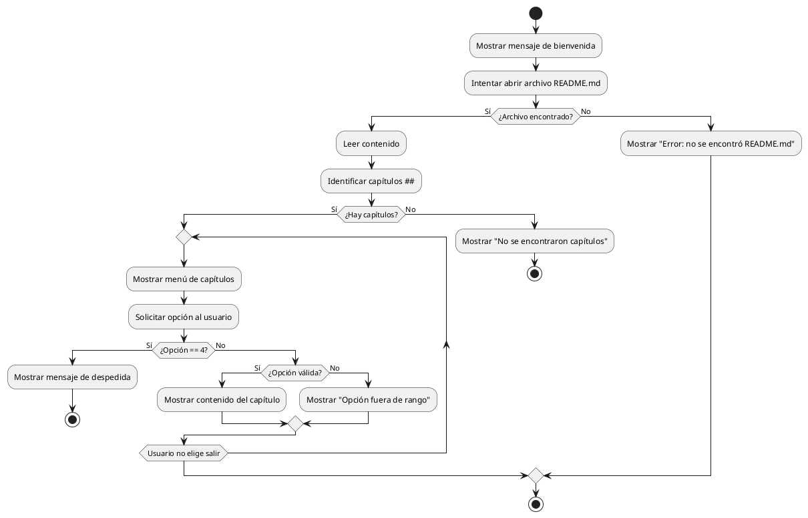

# Entregable No. 1

## Identificación del tema, problema y solución

Se poseen datos de la tienda Aurelion destinados a ser analizados para responder los siguientes interrogantes preliminares debido a que aún no se tiene conocimiento del estado del negocio:

  

- ¿Cuales son los productos más y menos vendidos, y cuales no generan ventas?

- ¿Cuales son los clientes que más compran?

- ¿Cuales son las ciudades que registran más ventas?

- ¿Cuales son los días o meses que más ventas se registran?

- ¿Cuales son los medios de pago más utilizados?

- ¿Cuales son los clientes más antiguos?

  
  

**Problemas hallados en los datos:**

- Las categorías están mal asignadas

  

## Dataset de referencia

### Estructura

la información está dividida en 4 tablas o entidades conformadas de la siguiente manera NOMBRE DE TABLA(atributos)

  

- CLIENTES(id_cliente, nombre_cliente, email, ciudad, fecha_alta)  

- PRODUCTOS (id_producto, nombre_producto, categoria, precio_unitario)  

- DETALLE_VENTAS (id_venta, id_producto, nombre_producto, cantidad, precio_unitario, importe)  

- VENTAS (id_venta, fecha, id_cliente, nombre_cliente, email, medio_pago)

  

### Tipos

Según su estructura los datos suministrados son de tipo **estructurado**.  

Según su origen asumimos que los datos los suministra algún tipo de sistema POS, por tanto, son **secundarios**.

  
  
  

### CLIENTES

| id_cliente   | nombre_cliente  | email         | ciudad        | fecha_alta    |
|--------------|-----------------|----------------|----------------|----------------|
| Cualitativo  | Cualitativo     | Cualitativo   | Cualitativo   | Cualitativo   |

---

### VENTAS

| id_venta     | fecha                   | id_cliente   | nombre_cliente | email         | medio_pago   |
|---------------|--------------------------|---------------|----------------|----------------|---------------|
| Cualitativo   | Cuantitativo (fecha)     | Cualitativo   | Cualitativo    | Cualitativo    | Cualitativo   |

---

### PRODUCTOS

| id_producto  | nombre_producto | categoria     | precio_unitario |
|---------------|----------------|----------------|-----------------|
| Cualitativo   | Cualitativo    | Cualitativo    | Cuantitativo    |

---

### DETALLE_VENTAS

| id_venta     | id_producto     | nombre_producto | cantidad     | precio_unitario | importe     |
|---------------|----------------|-----------------|---------------|-----------------|--------------|
| Cualitativo   | Cualitativo    | Cualitativo     | Cuantitativo  | Cuantitativo    | Cuantitativo |

---
  

## Información, pasos, pseudocódigo y diagrama del programa

  

### Información general

El siguiente programa en Python permite leer un archivo Markdown (`README.md`), identificar los capítulos principales (niveles de encabezado `##`) y mostrar su contenido de manera interactiva en consola.  

El usuario puede elegir qué capítulo desea visualizar y salir del programa cuando lo desee.

  

### Pasos generales del programa

1. Mostrar mensaje de bienvenida.  

2. Leer el archivo `README.md` línea por línea.  

3. Detectar los capítulos a partir de los encabezados `##`.  

4. Guardar los títulos y su contenido en un diccionario.  

5. Mostrar un menú con los capítulos disponibles.  

6. Permitir al usuario seleccionar un capítulo para ver su contenido.  

7. Repetir el proceso hasta que el usuario elija la opción de salir.  

8. Mostrar mensaje de despedida.

  

---

  

### Pseudocódigo del programa

  

```text

INICIO DEL PROGRAMA

  

    MOSTRAR "👋 Bienvenido al lector de capítulos del archivo README.md 📘"

  

    DEFINIR ruta ← "README.md"

  

    INTENTAR

        lineas ← LEER_ARCHIVO(ruta)

        capitulos ← OBTENER_CAPITULOS(lineas)

  

        SI capitulos ESTÁ VACÍO ENTONCES

            MOSTRAR "⚠️ No se encontraron capítulos (##) en el archivo."

            FINALIZAR PROGRAMA

        FIN SI

  

        REPETIR

            MOSTRAR_MENU(capitulos)

            MOSTRAR "Seleccione un capítulo por número: "

            LEER opcion

  

            SI opcion NO ES NÚMERO ENTONCES

                MOSTRAR "❌ Por favor ingrese un número válido."

                CONTINUAR CICLO

            FIN SI

  

            SI opcion = (NÚMERO DE CAPÍTULOS + 1) ENTONCES

                MOSTRAR "👋 Gracias por usar el lector de Markdown. ¡Hasta pronto!"

                SALIR DEL CICLO

            SINO SI opcion ENTRE 1 Y NÚMERO DE CAPÍTULOS ENTONCES

                titulo ← CAPÍTULO EN POSICIÓN (opcion - 1)

                MOSTRAR "--- " + titulo + " ---"

                MOSTRAR capitulos[titulo]

                MOSTRAR "--------------------------------------------------"

            SINO

                MOSTRAR "⚠️ Opción fuera de rango."

            FIN SI

  

        HASTA QUE opcion SEA IGUAL A (NÚMERO DE CAPÍTULOS + 1)

  

    CAPTURAR EXCEPCIÓN FileNotFoundError

        MOSTRAR "❌ No se encontró el archivo README.md en el directorio actual."

  

FIN DEL PROGRAMA

  
  

FUNCIÓN LEER_ARCHIVO(ruta)

    ABRIR archivo EN modo lectura CON codificación UTF-8

    LEER todas las líneas EN una lista

    CERRAR archivo

    RETORNAR lista de líneas

FIN FUNCIÓN

  
  

FUNCIÓN OBTENER_CAPITULOS(lineas)

    CREAR diccionario vacío capitulos

    titulo_actual ← NULO

    contenido_actual ← lista vacía

  

    PARA CADA linea EN lineas HACER

        SI linea EMPIEZA CON "## " ENTONCES

            SI titulo_actual NO ES NULO ENTONCES

                capitulos[titulo_actual] ← UNIR contenido_actual EN TEXTO

                contenido_actual ← lista vacía

            FIN SI

            titulo_actual ← linea SIN "## " Y SIN ESPACIOS

        SINO SI titulo_actual NO ES NULO ENTONCES

            AGREGAR linea A contenido_actual

        FIN SI

    FIN PARA

  

    SI titulo_actual NO ES NULO ENTONCES

        capitulos[titulo_actual] ← UNIR contenido_actual EN TEXTO

    FIN SI

  

    RETORNAR capitulos

FIN FUNCIÓN

  
  

FUNCIÓN MOSTRAR_MENU(capitulos)

    MOSTRAR "Capítulos disponibles:"

    PARA i DESDE 1 HASTA NÚMERO DE CAPÍTULOS HACER

        MOSTRAR i + ". " + NOMBRE_DEL_CAPITULO

    FIN PARA

    MOSTRAR (NÚMERO DE CAPÍTULOS + 1) + ". Salir"

FIN FUNCIÓN
```




